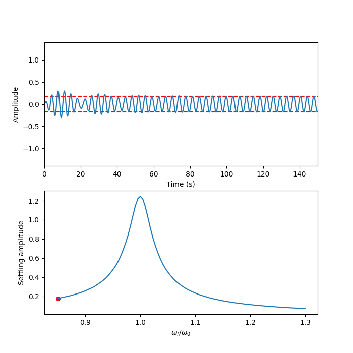

# visual-physics-demos
Visualizations used in UCLA Physics 4AL and 4BL

## Two dimensional interference
Interference between two wave sources at y=0. Time averaging over the sum of sources gives the amplitude of the interference pattern recorded on a microphone or seen on a screen.

## Damped oscillations

Harmonic oscillator damped by an increasing q factor.

## Forced oscillations
Traces the resonance curve of a forced harmonic oscillator

